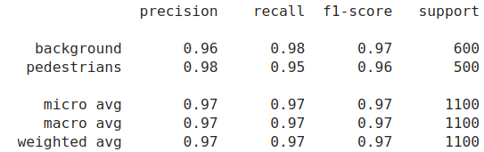
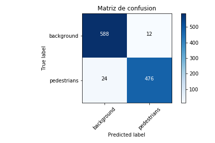
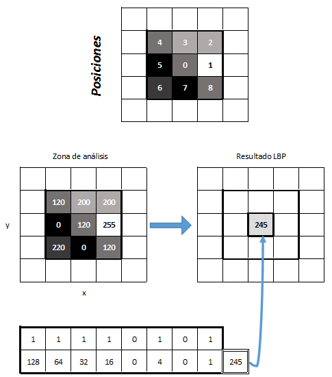
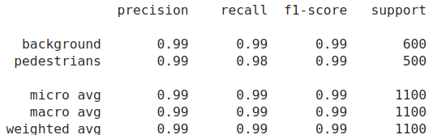
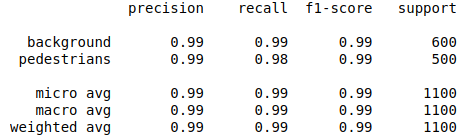
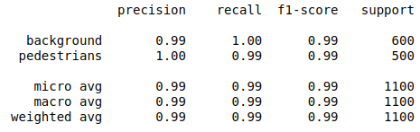
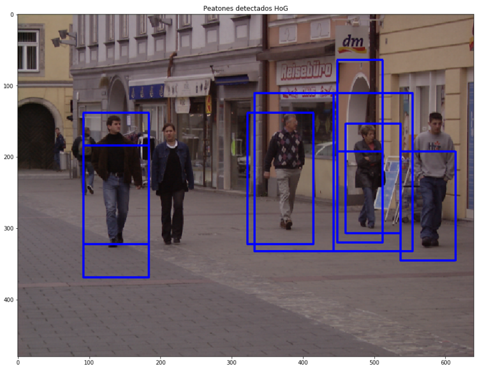
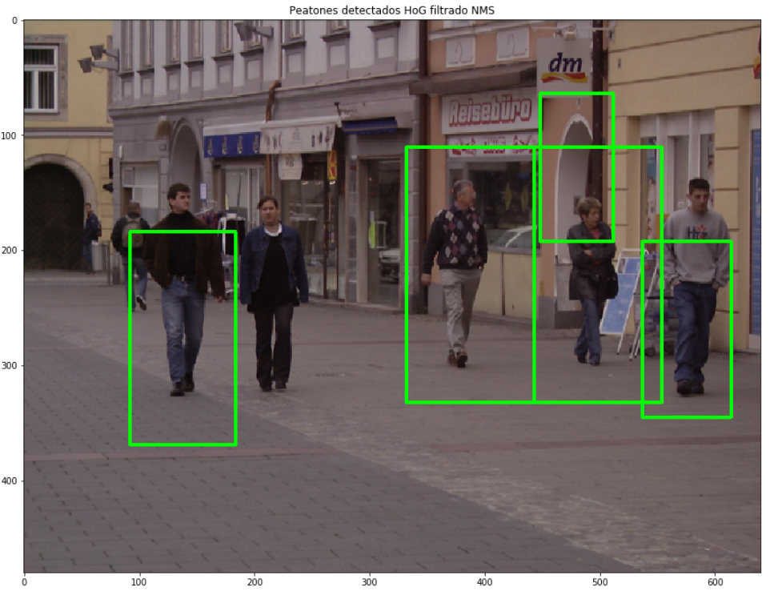

# Introducción

El objetivo es implementar descriptores para la extracción de rasgos de imágenes. De forma concreta la aplicación sera al problema de distinguir peatones del fondo.

## Métricas de evaluación empleadas

Para evaluar el rendimiento de los descriptores en combinación con un algoritmo de aprendizaje automático para realizar la clasificación se utilizarán las siguientes métricas.

- Precisión: VP / (VP + FP)
- Recall (sensibilidad o exhaustividad) = VP / (VP + FN)
- F1 = 2 * (( Precisión * Recall ) / (Precisión + Recall) )
- Exactitud (Accuracy en inglés): PR / PT

Donde

- VP: Verdaderos positivo (TP en inglés)
- FP: Falso positivo (FP en inglés)
- FN: Falso negativo (FN en inglés)
- PR: predicciones realizadas
- PT: predicciones totales

Precision es la habilidad de un clasificador de no clasificar una instancia como positiva, cuando es negativa.

Recall es la habilidad de un clasificador de encontrar todas las instancias positivas.

El puntaje F1 es una media armonica pesada de precision y recall, lo deseable es un puntaje de 1. 

# Histograma de orientaciones (HoG)

Comenzamos con el descriptor HoG de la librería OpenCV (https://opencv.org/). El objetivo es obtener un descriptor que luego nos permita entrenar un modelo de machine learning para distinguir el concepto **peatón** vs **fondo**.

El fichero **HOG.ipynb** posee el código correspondiente implementado en Python 3.7 y utizando JupyterLab https://jupyterlab.readthedocs.io/en/stable/ como IDE.

En el fichero _HOG.ipynb_ se encuentra la sección **sección 1. Paso del código de Java a Python** donde se cargan los datos de entrenamiento en las carpetas.

- "data/train/pedestrians/" 1916 imágenes de peatones
- "data/train/background/" 2390 imágenes de fondo

y se obtiene el descritor HoG para cada una de las imágenes.

Luego se entrena un modelo de machine learning utilizando el algoritmo SVM implementado en el paquete de Python scikit-learn (https://scikit-learn.org/stable/). Se utilizan parámetros por defecto y un kernel **lineal** para el entrenamiento.

Se prueba el modelo sobre dos imágenes de test

- "AnnotationsPos_0.000000_crop_000011b_0.png"
- "AnnotationsNeg_0.000000_00000002a_0.png"

Las cuales fueron clasificadas de forma correcta.

## Ejecución sobre el conjunto de test

Tenemos los siguientes datos de test

- 500 imágenes de peatones
- 600 imágenes de fondo

para que podamos evaluar el algoritmo. La primer mejora consiste en determinar las métricas del algoritmo SVM ya entrenado sobre este conjunto de datos de prueba.

El código empleado para la prueba se encuentra en la **sección 2. Pruebas sobre el conjunto de datos de test** del fichero _HOG.ipynb_

La tarea consistió en desarrollar la función _loadTestingData_ que se encarga de cargar los datos de test y obtener el descritor HoG para cada una de ellas. 

Luego se aplica el modelo sobre este conjunto de imágenes. Para evaluar los resultados primero utilice la función **classification_report** del paquete scikit-learn que calcula métricas sobre la ejecución del algoritmo comparando las etiquetas conocidas para los datos de test con las predicciones realizadas por la SVM. Los resultados obtenidos se muestran en la **Figura \ref{img:img1}**.

```{r figs, echo = FALSE, fig.width=4, fig.height=3, fig.cap="\\label{img:img1}Estadísticas predicción sobre el dataset de test para el descriptor HoG utilizando el algoritmo SVM con kernel lineal y parámetros por defecto."}

```

Se puede observar que teniendo en cuenta la métrica F1 obtenemos un valor promedio de 0.97 el cual es muy alto.

Para tener mas claridad programe la función **plot_confusion_matrix** que grafica una matriz de confusión, para que podamos observar de forma detallada donde se equivoca el algoritmo. Ver **Figura \ref{img:img2}**.

```{r figs2, echo = FALSE, fig.width=5, fig.height=4, fig.cap="\\label{img:img2}Matriz de confusión predicción sobre el dataset de test para el descriptor HoG utilizando el algoritmo SVM con kernel lineal y parámetros por defecto."}

```

### Conclusiones parciales
Podemos observar que 24 peatones fueron clasificados de forma errónea como fondo, y 12 imágenes de fondo fueron clasificadas de forma errónea como peatones. Esto indica que estamos cometiendo más errores para clasificar correctamente nuestra clase positiva (peatones). A pesar de esto nuestro algoritmo con un puntaje F1 de 0.97 indica que el modelo distingue muy bien los peatones del fondo.

## Implementación de K-Fold Cross Validation
Hasta ahora se entreno el modelo sobre un conjunto de datos de entrenamiento y luego el modelo fue probado sobre un conjunto de datos de test. Sin embargo al realizar la evaluación de nuestro modelo de esta forma podemos tener el problema de que las particiones utilizadas para entrenar y probar el algoritmo no son representativas o tienen algun tipo de bias. Para solucionar esto podemos utilizar validación cruzada. La validación cruzada es una técnica utilizada para evaluar los resultados de un análisis estadístico y garantizar que son independientes de la partición entre datos de entrenamiento y prueba. 

En este caso implemente 10 Fold Cross Validation, en este proceso lo que hago es mezclar los datos que antes estaban dividios en train y test en un solo dataset, el cual es partido en 10 particiones. El modelo se entrena sobre 9 particiones y se evalua sobre la restante, luego se repite el proceso entrenando en 9 particiones y testeando en la otra, asi de forma iterativa hasta que las 10 particiones hayan sido utilizadas como conjunto de test. El código empleado se encuentra en la sección **sección 3. K Fold Cross Validation** del fichero _HOG.ipynb_ ( _HOG.html_ ).

Los resultados obtenidos fueron los siguientes.

- Exactitud Promedio (Varianza): 0.9628 (+/- 0.0164)
- Exactitud de cada fold = [0.9704 0.9556 0.9482 0.9519 0.9667 0.9704 0.9593 0.9741 0.9648 0.9667]

### Conclusiones parciales
La exactitud promedio fue cercana a 0.96 con una varianza de +/- 0.0164, esto indica que de forma independiente de las particiones de entrenamiento y testeo utilizadas como parte del proceso de validación cruzada nuestro modelo es estable, lo cual nos interesa. Estos resultados indican que de forma promedio el 96% de las predicciones realizadas son correctas.

## Exploración de hiperparámetros para el algoritmo HoG-SVM
Hasta ahora solo se había utilizado la SVM con el kernel lineal y el resto de parámetros por defecto, sin embargo el algoritmo SVM tiene diversos hiperparámetros que pueden ser ajustados con el objetivo de mejorar u optimizar el modelo.

El código empleado para este análisis se encuentra en la **sección 4. Ajuste hiperparámetros** del documento _HOG.ipynb_ ( _HOG.html_ ).

Para este ajuste utilize la función **grid_search** del paquete scikit-learn al cual dada una serie de parámetros prueba las diferentes combinaciones de los mismos para evaluar cual es la mejor. Además como parte del proceso le indique que para cada posible combinación de parámetros realize 5-Fold Cross Validation.

En la tabla a continuación se indican cuales fueron los parámetros que se probaron.

- C: [0.01, 1, 10]
- gamma: [0.01, 1, 10]
- kernel: ['linear', 'rbf', 'poly']
    
Como parte de este proceso el mejor resultado de 5-Fold Cross Validation fue para un modelo entrenado con los siguiente parámetros:

- Mejores parámetros = {'C': 10, 'gamma': 0.01, 'kernel': 'rbf'}

Y la exactitud obtenida fue de 0.9757

Los resultados completos se pueden ver en la **Tabla \ref{tab:tab1}**.

```{r, echo = FALSE}
df.res.previos <- data.frame("param_C" = "default", "param_gamma" = "default", 
                             "param_kernel" = "lineal", "mean_test_score" = 0.9628, 
                             "std_test_score" = 0.0164, "K_crossvalidation" = 10)
df.hog <- read.table("HOG_hiperparametros.csv", head = T, sep = ",")
df.hog <- df.hog[,colnames(df.hog) %in% c("param_C", "param_gamma", "param_kernel",
                                          "mean_test_score", "std_test_score")]
#df.hog$K_crossvalidation <- 5
#df <- rbind(df.res.previos, df.hog)
kable(df.hog, "latex", caption = "\\label{tab:tab1}. Resultados exploración hiperparámetros HoG + SVM", booktabs = T) %>%
          kable_styling(latex_options = c("striped")) %>%
          kableExtra::kable_styling(latex_options = "hold_position", font_size = 9)


```

Al observar la Tabla \ref{tab:tab1} llama la atención que el mejor resultado fue obtenido con el kernel rbf para C:10 y gamma:0.01, sin embargo el mismo kernel con otras combinaciones de parámetros obtuvo resultados muy malos, incluso varias combinaciones de parámetros con kernel rbf dieron una exactitud promedio cercana al 55%, lo cual esta levemente por encima de una predicción al azar. Por este motivo decidi realizar 10 Fold Cross Validation con el mejor conjunto de parámetros, para ver si es estable con respecto a los resultados recien presentados, que fueron obtenidos con 5 Fold Cross Validation.

Los resultados obtenidos para 10 Fold Cross Validation y parámetros kernel:rbf, C:10, gamma:0.01 fueron los siguientes:

- Exactitud Promedio (Varianza): 0.9784 (+/- 0.0201)
- Exactitud de cada fold= [0.98890943 0.97227357 0.96487985 0.96303142 0.97966728 0.99075786 0.97222222 0.99074074 0.97407407 0.98703704]

### Conclusiones parciales
El resultado obtenido indica una mejora de 0.0129 con respecto a los parámetros por defecto del algoritmo SVM y un kernel lineal. Es de notar que el mejor resultado fue obtenido con el kernel **rbf**. De la tabla de resultados se desprende que este kernel funciona con un parámetro baja pequeño (en este caso con el valor 0.01), cuando el parámetro gamma es alto el kernel no funciona de forma correcta.
Los kernel linear y poly se compartan de forma muy similar al cambiar los parámetros C y gamma. Diferentes combinaciones de estos dos parámetros para el mismo kernel dan resultados iguales.El kernel poly tiene una exactitud promedio aproximadamente 1% superior al kernel lineal con los parámetros evaluados.

## Resultados finales del bloque HoG y discusión

Es muy interesante que la combinación de parámetros que mejor funciona para el HoG utilizando SVM sea el kernel rbf con una combinación particular de parámetros C y gamma. Si tuviera que elegir cual seria el modelo que aplicaría a futuro para la detección de peatones seria uno utilizando el kernel poly, ya que demostro ser mucho mas estable que el kernel rbf a diferentes valores de C y gamma.

\newpage
# Local Binnary Patterns (LBP)

El primer paso para construir el descriptor LBP es convertir la imagen a escala de gris. Para cada pixel de la imagen, se selecciona un vecindario de tamaño r que rodea el centro del pixel. El valor LBP se calcula para cada centro y se guarda en un array 2D del mismo tamaño que la imagen de entrada.

```{r figslbp, echo = FALSE, fig.width=5, fig.height=4, fig.cap="\\label{img:lbpbasico}Imagen calculo de los coeficientes para el LBP."}

```

Cuando el valor del píxel 'vecino' sea igual o mayor al valor del píxel central, se asigna un valor 1 al bit de posición y en caso contrario se asigna un valor 0 hasta completar la comparación con los 8 píxeles adyacentes y formar un numero binario, en el caso del ejemplo de la **Figura \ref{img:lbpbasico}** seria: ´11110101´ dicho valor binario se transforma a su equivalente decimal ´245´ el cual corresponde al nuevo valor de intensidad de la imagen LBP.

## Implementación de LBP-básico

El objetivo de este ejercicio consiste en implementar la versión básica de LBP. Esto consiste en cálculo de códigos LBP considerando sus 8-vecinos más cálculo por bloques de histogramas (recordemos que el descriptor corresponderá a la concatenación de los histogramas individuales de cada bloque). Siguiendo la línea del ejemplo de clase, se consideraron ventanas de 128x64, celdas de 16x16 y desplazamientos de dxx=dyy=8. Esto genera 105 bloques por ventana y un descriptor de 105·256=26880 características.

A continuación se muestra el código generado para calcular el LBP básico de una imagen de acuerdo a los criterios mencionados en el parrafo anterior.

```{python eval = FALSE}
def get_pixel_value(imagen, x_pos, y_pos):
    """
    Función para obtener el valor numérico de un determinado pixel.
    
    Parámetros:
     - imagen: imagen a analizar
     - x_pos: posición del pixel en el eje X
     - y_pos: posición del pixel en el eje Y
     
     Retorna:
     - valor del pixel
    """
    valor = 0
    try:
        valor = imagen[x_pos, y_pos]
    except:
        pass
    return valor

def get_bin_info(imagen, punto, x_pos, y_pos):
    """
    Función que ejecuta el thresholding para el algoritmo LBP.
    
    Parámetros:
     - imagen: imagen a analizar
     - punto: valor del pixel central
     - x_pos: posición del pixel en el eje X
     - y_pos: posición del pixel en el eje Y
     
     Retorna:
     - valor del thresholding, 0 o 1
    """
    valor = get_pixel_value(imagen, x_pos, y_pos)
    valor_binario = 1 if valor >= punto else 0
    return valor_binario


def get_LBP(imagen):
    """
    Función que calcula el descritptor LBP para una imagen
    
    Parámetros:
     - imagen: imagen a analizar
     
     Retorna:
     - array del descritptor LBP
    """
    alto_maximo = imagen.shape[0]
    ancho_maximo = imagen.shape[1]

    lbp_array = np.array([])

    for wx in np.arange(0, alto_maximo - 8, 8):
        for wy in np.arange(0, ancho_maximo - 8, 8):

            mapa_textura = np.zeros((16, 16, 3), np.uint8)

            for x in np.arange(wx, wx+16, 1):
                for y in np.arange(wy, wy+16, 1):

                    # Variable auxiliar para almacenar el valor binario
                    binario_punto = []

                    # Obtengo la informacion de cada pixel y los 8 que estan alrededor
                    punto = get_pixel_value(imagen, x, y)  # Fila columna
                    arr_izq = get_bin_info(imagen, punto, x - 1, y - 1)
                    binario_punto.append(arr_izq)
                    arr_med = get_bin_info(imagen, punto, x - 1, y)
                    binario_punto.append(arr_med)
                    arr_der = get_bin_info(imagen, punto, x - 1, y + 1)
                    binario_punto.append(arr_der)
                    der_med = get_bin_info(imagen, punto, x, y + 1)
                    binario_punto.append(der_med)
                    der_ab = get_bin_info(imagen, punto, x + 1, y + 1)
                    binario_punto.append(der_ab)
                    ab_med = get_bin_info(imagen, punto, x + 1, y)
                    binario_punto.append(ab_med)
                    ab_izq = get_bin_info(imagen, punto, x + 1, y - 1)
                    binario_punto.append(ab_izq)
                    izq_med = get_bin_info(imagen, punto, x, y - 1)
                    binario_punto.append(izq_med)

                    # Obtengo el valor decimal a partir del binario
                    valor_decimal = int(''.join(map(str, binario_punto)), 2)

                    # Agrego el valor al mapa textura
                    mapa_textura[x-wx, y-wy] = valor_decimal

            # Calculo el histograma
            hist = cv2.calcHist([mapa_textura], [0], None, [256], [0, 256])
            
            # Normalizo
            cv2.normalize(hist, hist)

            # Me aseguro que sea 1 dimensional
            hist2 = hist.ravel()
            # Lo agrego a la salida
            lbp_array = np.append(lbp_array, hist2)
    return(lbp_array)
```


El código completo se encuentra en **sección 1. Implementación funciones para el cálculo del descriptor LBP** del documento _LBP.ipynb_ ( _LBP.html_ ).

## Prueba sobre el dataset de test

Una vez que implemente la funcion para el calculo del LBP, modifique la funcion de carga de datos de entrenamiento que utilice en la sección de HoG. Realice la carga de datos calculando el descriptor LBP y luego entrene un modelo SVM con kernel lineal.

Luego probe el modelo sobre el dataset de test (500 imágenes de peatones y 600 de fondo). Los resultados obtenidos se pueden ver en la **Figura \ref{img:img3}**.

```{r figs3, echo=FALSE, fig.width=4, fig.height=3, fig.cap="\\label{img:img3}Estadísticas predicción sobre el dataset de test para el descriptor LBP básico utilizando el algoritmo SVM con kernel lineal y parámetros por defecto."}

```

En la **Figura \ref{img:img4}** podemos ver la matriz de confusion para estos resultados.

```{r figs4, echo=FALSE, fig.width=5, fig.height=4, fig.cap="\\label{img:img4}Matriz de confusión predicción sobre el dataset de test para el descriptor LBP utilizando el algoritmo SVM con kernel lineal y parámetros por defecto."}

```

El código utilizado se encuentra en la **sección 2. Prueba sobre el dataset de test** del documento _LBP.ipynb_ ( _LBP.html_ ).

### Conclusiones parciales
Podemos observar que la combinación LBP+SVM mejora la performance sobre el dataset de test con respecto a la combinación HoG+SVM. En ambos casos considerando la SVM con un kernel lineal y el resto de parámetros por defecto.

Seguimos cometiendo más errores al querer clasificar los peatones y lo confundimos con el fondo, pero bajamos de 24 errores a 8 en este caso. Lá metrica promedio F1 es de 0.99 lo cual es muy alto.

## Implementación de K-Fold Cross Validation
Al igual que en el caso de HoG+SVM lo que hago es unir los datasets de train y test en un único dataset y aplico el esquema de validación cruzada con un valor de K=10. La SVM utiliza un kernel lineal y el resto de parámetros por defecto.

Los resultados obtenidos fueron los siguientes.

- Exactitud Promedio (Varianza): 0.9939 (+/- 0.0055)
- Exactitud de cada fold = [0.9926 0.9926 0.9926 0.9945 0.9982 0.9926 0.9963 0.9926 0.9889 0.9981]

El código se encuentra en la **sección 3. Implementación de validación cruzada** del documento _LBP.ipynb_ ( _LBP.html_ ).

### Conclusiones parciales
Los resultados obtenidos con la combinación LBP+SVM mejoran 0.0155 con respecto a los obtenidos con la combinación HoG+SVM, cuando consideramos en ambos casos los parámetros por defecto de la SVM con kernel lineal.

## Exploración de hiperparámetros para el algoritmo LBP-SVM

La estrategia empleada en este caso fue la misma que para el caso de HoG+SMV, se definió una grilla de parámetros a explorar y la función grid_search de scikit-learn se encarga de probar las posibles combinaciones de estos parámetros, utilizando validación cruzada con un parámetro de K=5.

Los hiperparámetros utilizados en este caso fueron los siguientes:

- C: [0.01, 1, 10]
- gamma: [0.01, 1, 10]
- kernel: ['linear', 'rbf', 'poly']

La cantidad de features que utiiza el descriptor LBP básico toma mucho tiempo para correr en mi computadora personal. La ejecución con estos parámetros demoro alrededor de 15 horas.


Los resultados completos se pueden ver en la **Tabla \ref{tab:tab2}**.

```{r, echo = FALSE}
df.lbp <- read.table("LBP_hiperparametros.csv", head = T, sep = ",")
df.lbp <- df.lbp[,colnames(df.lbp) %in% c("param_C", "param_gamma", "param_kernel",
                                          "mean_test_score", "std_test_score")]
#df.hog$K_crossvalidation <- 5
#df <- rbind(df.res.previos, df.hog)
kable(df.lbp, "latex", caption = "\\label{tab:tab2}. Resultados exploración hiperparámetros LBP + SVM", booktabs = T) %>%
          kable_styling(latex_options = c("striped")) %>%
          kableExtra::kable_styling(latex_options = "hold_position", font_size = 9)
```

El código se encuentra en la **sección 4. Exploración de hiperparámetros** del documento _LBP.ipynb_ ( _LBP.html_ ).


### Conclusiones parciales
La SVM con kernel poly y cualquier combinación de parámetros junto al kernel rbf con gamma: 0.01 y C:10 dan los mejores resultados, exactitud promedio 0.994266.

El kernel rbf al igual que con HoG funciona muy mal si el parámetro C no es pequeño. En base a lo aprendido con el descriptor HoG, quizas una modificación del parámetro gamma, hacerlo más pequeño mejore la performance del kernel rbf.

## Conclusiones del bloque LBP

Es importante hacer notar que el kernel lineal en donde modificamos los parámetros C y gamma funciona un poco peor que con los parámetros por defecto. Esto indica que podemos probar con otros valores en la exploración de parámetros, o utilizar un algoritmo genético para explorar nuevos parámetros.

El único parámetro que produce cambios en la exactitud promedio es el kernel, ya que el mismo kernel con diferentes parámetros de C y gamma obtiene la misma exactitud en las pruebas realizadas para kernel linel y poly, no sucede lo mismo para el kernel rbf, que se muestra sensible al parámetro C. Esto se puede observar en la columna **mean_test_score** de la Tabla \ref{tab:tab2}. 

Al comparar los resultados de LBP+SVM vs HoG+SVM podemos observar que LBP se comporta mejor que HoG al menos sobre este set de datos. La diferencia no es demasiada. Una buena opción es unir ambos descriptores para probar si de esta forma la clasificación mejora, ya que cada descriptor puede capturar diferentes aspectos de los datos y al ser combinados el poder de discriminación aumenta.

\newpage
# Mejoras voluntarias

## LBP uniforme

Una variante ampliamente usada de los LBP son los conocidos como patrones uniformes. Seleccionando solo patrones uniformes se logra reducir la longitud del vector característico y mejorar los clasificadores, adicionalmente,  se puede aplicar esta técnica para obtener invarianza ante rotaciones. Un LBP es ‘uniforme’ cuando contiene como máximo dos transiciones de ‘1 a 0’ y/o de ‘0 a 1’ por ejemplo: 000100 posee dos transiciones (es LBP-U), 010101001  posee siete transiciones (no es LBP-U). Al computar el histograma del LBP, se le asigna un valor separado por cada patrón uniforme y todos los patrones no uniformes son asignados a un valor único. Usando esta técnica se puede reducir un la longitud de un vector desde 256 a 59 espacios.

Para implementarlo precalcule todas las posibles combinaciones y les preasigne los valores. Es decir tome todos los valores hasta 255, le calcule el binario y conte las transiciones, de forma ordenada le preasigno un entero hasta el valor 57 a los patrones uniformes y el valor 58 a los no uniformes (considerando índice 0).

```{python eval=FALSE}

def precalcule_LBPu(label_binario):
    """
    Función para precalcular el LBP uniforme
    Creo una matriz con todas las transiciones del LBP común al LBP uniforme
    De esta forma solo se deben calcular una vez
    """
    previo = label_binario[-1]
    transiciones = 0
    for i in range(0, len(label_binario)):
        actual = label_binario[i]
        if actual != previo:
            transiciones += 1
        previo = actual
    return transiciones


# obtengo los uniformes
look_up_table = {}
index = 0
for i in range(0, 256):
    binario = bin(i)[2:].zfill(8)
    variaciones = precalcule_LBPu(binario)
    if variaciones <= 2:
        look_up_table[i]=index;
        index = index + 1
    else:
        look_up_table[i] = 58

```

Luego introduje las modificaciones necesarias al código original LBP para utilizar este nueva codificación.

El código empleado se encuentra en el fichero **LBP_uniforme.ipynb** (**LBP_uniforme.html**).

### Prueba sobre el dataset de test

En la **Figura \ref{img:imglbpu}** se encuentran las métricas de los resultados y en la **Figura \ref{img:lbpu_cm}** podemos ver la matriz de confusion para estos resultados.

```{r figstablbpu, echo=FALSE, fig.width=4, fig.height=3, fig.cap="\\label{img:imglbpu}Estadísticas predicción sobre el dataset de test para el descriptor LBP uniforme utilizando el algoritmo SVM con kernel lineal y parámetros por defecto."}

```

```{r figslbpucm, echo=FALSE, fig.width=5, fig.height=4, fig.cap="\\label{img:lbpu_cm}Matriz de confusión predicción sobre el dataset de test para el descriptor LBP uniforme utilizando el algoritmo SVM con kernel lineal y parámetros por defecto."}

```

#### Conclusiones parciales

Al comparar LBPu+SVM vs LBP+SVM la performance es muy similar. LBPu solo se equivoca en un 1 caso más que LBP (fondo). Sin embargo el cálculo del descriptor y las predicciones con LBPu son bastante más rapidas, debido a que se computan menos features.

### Implementación de K-Fold Cross Validation
Al igual que en el caso de HoG+SVM y LBP+SVM lo que hago es unir los datasets de train y test en un único dataset y aplico el esquema de validación cruzada con un valor de K=10. La SVM utiliza un kernel lineal y el resto de parámetros por defecto.

Los resultados obtenidos fueron los siguientes.

- Exactitud Promedio (Varianza): 0.9911 (+/- 0.0052)
- Exactitud de cada fold= [0.9908 0.9926 0.9889 0.9926 0.9945 0.9926 0.9926 0.9926 0.9852 0.9889]

#### Conclusiones parciales

Con respecto a LBP+SVM la combinación LBPu+SVM empeora un 0.0028 teniendo en cuenta la métrica de exactitud promedio

La mínima perdida en exactitud se compensa con la ganancia en velocidad del LBPu, el cual se ejecuta más rapido en la implementación que realize en Python.

### Exploración de hiperparámetros para el algoritmo LBPu-SVM

Al igual para que HoG y LBP se tomaron los datos tanto de train como test y se genero una única matriz y un conjunto de parámetros a explorar para encontrar la combinación de parámetros que mejor funciona.

Los hiperparámetros utilizados en este caso fueron los siguientes:

- C: [0.01, 1, 10]
- gamma: [0.01, 1, 10]
- kernel: ['linear', 'rbf', 'poly']

Cada combinación fue evaluada con 5 Fold Cross Validation.

Los resultados obtenidos se encuentran en la **Tabla \ref{tab:tab3}**.

```{r, echo = FALSE}
df.lbp <- read.table("LBPu_hiperparametros.csv", head = T, sep = ",")
df.lbp <- df.lbp[,colnames(df.lbp) %in% c("param_C", "param_gamma", "param_kernel",
                                          "mean_test_score", "std_test_score")]
#df.hog$K_crossvalidation <- 5
#df <- rbind(df.res.previos, df.hog)
kable(df.lbp, "latex", caption = "\\label{tab:tab3}. Resultados exploración hiperparámetros LBPu + SVM", booktabs = T) %>%
          kable_styling(latex_options = c("striped")) %>%
          kableExtra::kable_styling(latex_options = "hold_position", font_size = 9)
```
 
#### Conclusiones parciales
El kernel con diferentes combinaciones de C y gamma y el kernel rbf con la combinación C:10 y gamma:0.01 tienen la mayor exactitud promedio para la combinación LBPu+SVM luego de la exloración de parámetros. El kernel lineal tiene una exactitud promedio muy cercana, pero es un poco menos variable. Cuando el kernel rbf utiliza combinaciones de parámetros con el parametro gamma > 0.01 da muy malores resultados (exactitud promedio cercana al 55%).


### Conclusiones Finales del bloque LBPu
Con respecto a la combinación LBP+SVM, LBPu+SVM luego de la optimización de parámetros se comporta levemente peor. Al comparar con HoG+SVM luego de la exploración de parámetros tenemos una mejora en la exactitud promedio. 

El kernel poly es el que mejor funciona para casi cualquier combinación de parámetros C y gamma. El kernel rbf si se elije gamma de forma adecuada funciona muy bien.
Esto es lo mismo que se observa para el LBP común y el HoG.

En un entorno donde debemos elegir un modelo preciso y rápido seguramente sacrificariamos una leve perdida de exactitud al elegir LBPu+SVM sobre LBP+SVM, ya que LBPu es más rapido en su ejecución, ya que considera un número menor de features.

## Combinación LBP + HoG
Las matrices con los descriptores LBP y HoG se puede combinaran en una única matriz, de esta forma para cada imagen tenemos la información de ambos descriptores, esto puede mejorar la discriminación de imágenes al incluir descriptores que tienen en cuenta diferentes características de la imagen para realizar la predicción.

El código desarrollado se encuentra en el fichero **Combinacion_HOG_LBP.ipynb** (**Combinacion_HOG_LBP.html**).

### Prueba sobre el dataset de test

La **Figura \ref{img:imgcomb}** muestra las métricas para la detección utilizando la combinación de HoG y LBP y la **Figura \ref{img:lbphog_cm}** muestra la matriz de confusión para la ejecución de la combinación HoG+LBP utilizando una SVM con kernel lineal. Al combinar LBP con HoG obtenemos una mejora en la detección de acuerdo a la matriz de confusion ahora solo nos equivocamos en 6 peatones en el dataset de test y en una imagen de fondo.

```{r figstabcomb, echo=FALSE, fig.width=4, fig.height=3, fig.cap="\\label{img:imgcomb}Estadísticas predicción sobre el dataset de test para la combinación de descriptores HoG y LBP utilizando el algoritmo SVM con kernel lineal y parámetros por defecto."}

```

```{r figshoglbp, echo=FALSE, fig.width=5, fig.height=4, fig.cap="\\label{img:lbphog_cm}Matriz de confusión predicción sobre el dataset de test para la combinación de descritores HoG y LBP utilizando el algoritmo SVM con kernel lineal."}

```

### Implementación de K-Fold Cross Validation
Luego probe realizar 10 Fold Cross Validation utilizando la combinación de descriptores, los resultados obtenidos fueron los siguientes:

- Exactitud Promedio (Varianza): 0.9950 (+/- 0.0055
- Exactitud de cada fold= [0.9963 0.9945 0.9945 0.9945 0.9982 0.9945 1.     0.9907 0.9907 0.9963]
 
#### Conclusiones parciales
Para las pruebas de 10 Fold Cross Validation hasta ahora los mejores resultados fueron obtenidos con LBP+SVM: exactitud promedio (Varianza): 0.9939 (+/- 0.0055), los resultados obtenidos por la combinación de LBP+HoG mejoran levemente estos resultados obtenidos.

Podemos observar que combinar ambos descriptor mejora la exactitud en la identificación de los peatones. Esto sin embargo trae el precio de un mayor costo computacional, debido a que ahora tenemos un mayor número de features.

## Localización de peatones a diferentes escalas
Hasta ahora se estuvo trabajando con imágenes de tamaño 128x64. Los datos de entrenamiento y testing solo tenían una imagen de peaton o fondo. En este caso se extiende el framework para detectar personas en imágenes de cualquier tamaño y a diferentes escalas. La idea es detectar las personas y marcarlas con un rectángulo.

Para desarrollar esto, utilize el descriptor HoG entrenado con los datos que nos entrego el profesor. Más concretamente, utilize todas las imágenes de ambas carpetas (train y test) para entrenar el modelo. El kernel utilizado fue rbf con parámetros C:10 y gamma:0.01, elegí estos parámetros porque fueron los que mejores resultados dieron en el proceso de optimización de hiperparámetros. 
**Algo muy importante es que agregue la opción probability=True**, esto es porque con esta opción puedo realizar predicciones en donde obtengo la probabilidad para cada clase, y esto luego lo usare para filtrar las detecciones de peatones para disminuir el número de falsos positivos.

```{python eval=FALSE}

# Creo una SVM con kernel rbf
clf = SVC(kernel="rbf", C = 10, gamma = 0.01, probability = True)

# Entreno la SVM
clf.fit(allData, allClasses)

# Guardo el modelo entreando
dump(clf, 'HOGbest_clf.joblib')

```


Dada una imagen de tamaño mxn lo que hago es tomar una porción de dicha imagen de tamaño 128x64, y pruebo en dicha porción si hay una persona, si se encuentra una persona y la probabilidad de esa clase es mayor a 0.9 guardo las posiciones en una lista. Para moverme por la imagen original utilizo desplazamientos de 32 pixeles tanto en el eje X como el eje Y.

Para solucionar los problemas de escala de la detección de las personas, creo pirámides de la imagen (pirámide multiescala) muestreando la imagen original a tamaños menore. De forma recursiva cada imagen se reduce a un 83% de la anterior. Esto se realiza con la siguiente función.

```{python eval=FALSE}

def get_pyramid(img):

    pyramid = [img] # Asigno la imagen sin escala como primer elemento
    new_level = img # Imagen sobre la que ire realizando las disminuciones de tamaño

    while np.shape(new_level)[0] >= 128 and np.shape(new_level)[1] >= 64:
        new_level = cv2.GaussianBlur(src=new_level, ksize=(7, 7), sigmaX=1)
        # 0.8333333 is 1 / 1.2
        new_level = cv2.resize(new_level, dsize=(0, 0), fx=0.8333333, fy=0.8333333)
        pyramid.append(new_level)
    return pyramid


```


El problema que nos encontramos al desarrollar esta metodología es la detección múltiple de la misma persona. Para solucionar esto utilize la técnica Non-Maximum Suppression (NMS), más concretamente la implementación en el paquete _imutils_ de python.

En el documento **deteccion_peatones_escalas.ipynb** (**deteccion_peatones_escalas.html**) se encuentra el codigo desarrollado.

### Resultados
A continuación se muestran las detecciones para una imagen de ejemplo, sin utilizar NMS y utilizando NMS. Recordemos además que solo se guardan detecciones para peatones en las cuales la SVM tiene una probabilidad para la clase mayor a 0.9

```{r figshogpea, echo=FALSE, fig.width=5, fig.height=4, fig.cap="\\label{img:hog_peaton_nms}Detección de peatones a diferentes escalas con el descriptor HoG y una SVM."}

```

```{r figshognms, echo=FALSE, fig.width=5, fig.height=4, fig.cap="\\label{img:hog_peaton_nms}Detección de peatones a diferentes escalas con el descriptor HoG y una SVM filtrando las detecciones con non max suppression."}

```


# Comparación gráfica de HoG+SVM, LBP+SVM, LBPu+SVM, HoG-LBP+SVM
Comparo los resultados por los diferentes descriptores implementados más la combinación HoG-LBP con la SVM con kernel lineal y parámetros por defecto obtenidos con 10 fold cross validation.

La **Figura \ref{img:compall}** muestra un boxplot con la exactitud para cada fold del proceso de validación cruzada para cada descriptor.

El empleo del descriptor HoG solo, es el que peor resultados obtiene. Al combinar HoG y LBP la exactitud promedio es la mas alta, seguido de LBP y luego LBPu.

La combinación de LBP+HoG clasifica correctamente todas las imagenes en uno de los folds analizados.

```{r figcompall, echo=FALSE, fig.width=5, fig.height=4, fig.cap="\\label{img:compall}Comparación de todos los descritpores en 10 Fold Cross Validation utilizando SVM con kernel lineal"}
HoG.10cv <- c(0.9704, 0.9556, 0.9482, 0.9519, 0.9667, 0.9704, 0.9593, 0.9741, 0.9648, 0.9667)
LBP.10cv <- c(0.9926, 0.9926, 0.9926, 0.9945, 0.9982, 0.9926, 0.9963, 0.9926, 0.9889, 0.9981)
LBPu.10cv <- c(0.9908, 0.9926, 0.9889, 0.9926, 0.9945, 0.9926, 0.9926, 0.9926, 0.9852, 0.9889)
HoGLBP.10cv <- c(0.9963, 0.9945, 0.9945, 0.9945, 0.9982, 0.9945, 1, 0.9907, 0.9907, 0.9963)
des <- c(rep("HoG", 10), rep("LBP", 10), rep("LBPu", 10), rep("HoG+LBP", 10))
df.res <- data.frame(Descriptor = des, CVaccuracy = c(HoG.10cv, LBP.10cv, LBPu.10cv, HoGLBP.10cv))

ggplot(data = df.res, aes(x = Descriptor, y = CVaccuracy)) + geom_boxplot()

```

